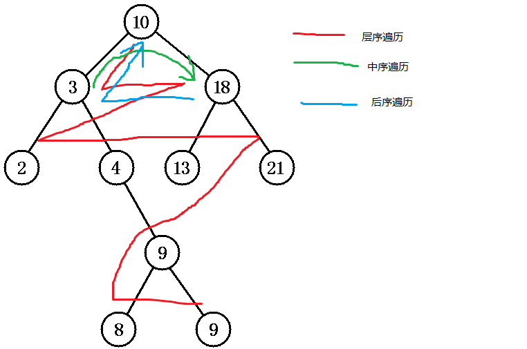

# 解题报告

### L1 - 002

纯模拟，记录还剩下的符号数和将要输出的符号数

注意: 不要有行末空格

复杂度: $O(N)$

计算层数和剩余符号:

```c++
int cnt = 1, cur = 0;
scanf("%d%s", &n, str);
while(n >= cnt){
  n-=cnt;
  cnt+=(cur == 0) ? 5 : 4;
  cur++;
}
```

(cnt 每层的符号数，cur 目前层数，n目前剩余符号数)


### L1 - 006

遍历 2 - $\sqrt N$，寻找并记录连续因子

复杂度: $O(N)$ 


### L1 - 010

使用`std::sort`

复杂度: $O(1)$


### L1 - 014

```c++
printf("This is a simple problem.\n");
```

复杂度: $O(1)$


### L1 - 018

注意:

端点时间是包含的

> 在午夜00:00到中午12:00期间（端点时间包括在内），笨钟是不敲的。

输入方法:

```c++
scanf("%d:%d", &h, &m);
```

输出方法

```c++
printf("%02d:%02d", h, m);
```

复杂度: $O(1)$


### L1 - 022

边输入边统计奇数和偶数个数

复杂度: $O(N)$


---

### L2 - 002

坑多，据说链表中间会断

使用`std::set<int>`存储已经出现的链表节点的值

( 插入复杂度$O(\log n)$, 查找复杂度$O(\log n)$ )

使用next数组模拟链表的指针，并维护链表的头节点和尾节点

总复杂度$O(n\log n)$


### L2 - 006

后序遍历特点: 后序遍历的末尾是子树的根



采用分治法建树，以后序遍历的根分割中序遍历的左右子树，再返回以左右子树的元素个数划分后序遍历

最后使用bfs层序遍历

分治: 划分的复杂度$O(n)$，处理的复杂度$O(1)$，合并的复杂度$O(1)$

层序遍历: 复杂度$O(n)$

总的复杂度: $O(n\log n)$


### L2 - 010

重要条件

>这里假设朋友的朋友也是朋友。但敌人的敌人并不一定就是朋友，朋友的敌人也不一定是敌人。只有单纯直接的敌对关系才是绝对不能同席的。

使用并查集维护朋友关系

使用邻接矩阵维护敌人关系

并查集复杂度: $O(\log ^* n)$，大致为$O(1)$ ([Wikipedia](https://en.wikipedia.org/wiki/Disjoint-set_data_structure#History))

邻接矩阵复杂度: $O(1)$

总复杂度: $O(M+K)$


---

### L3 - 002

求的中位数是指

> 对于N个元素，若N是偶数，则中值定义为第N/2个最小元；若N是奇数，则中值定义为第(N+1)/2个最小元。

##### 思路:

维护一个大项堆，一个小项堆，一个栈，保证两个堆元素个数相差不超过1，在此题中小项堆堆顶是所求的中位数

插入时如果大于中位数，则插入大项堆中，否则插入小项堆中

##### 输入:

不能使用STL

##### 数据结构:

两个map作为堆使用，写数组作为栈，同时维护两个map的实际大小

```c++
map<int, int, greater<int>> low;
int lowsize = 0;

map<int, int> high;
int highsize = 0;

int stk[100000];
int stkp = 0;
```

使用一个balance函数在每次修改后维护两个堆大小相差不超过1，并保证low的起始元素为要求的中位数

```c++
void balance(){
  if(lowsize - highsize >= 2){
    high[(*low.begin()).first]++;
    low[(*low.begin()).first]--;
    if(low[(*low.begin()).first] == 0) low.erase((*low.begin()).first);
    lowsize--;
    highsize++;
  }
  else if(highsize - lowsize >= 1){
    low[(*high.begin()).first]++;
    high[(*high.begin()).first]--;
    if(high[(*high.begin()).first] == 0) high.erase((*high.begin()).first);
    lowsize++;
    highsize--;
  }
  median = (*low.begin()).first;
}
```

##### 复杂度分析

balance函数 $O(\log n)$

大致复杂度 $O(n \log n)$

### L3 - 006

